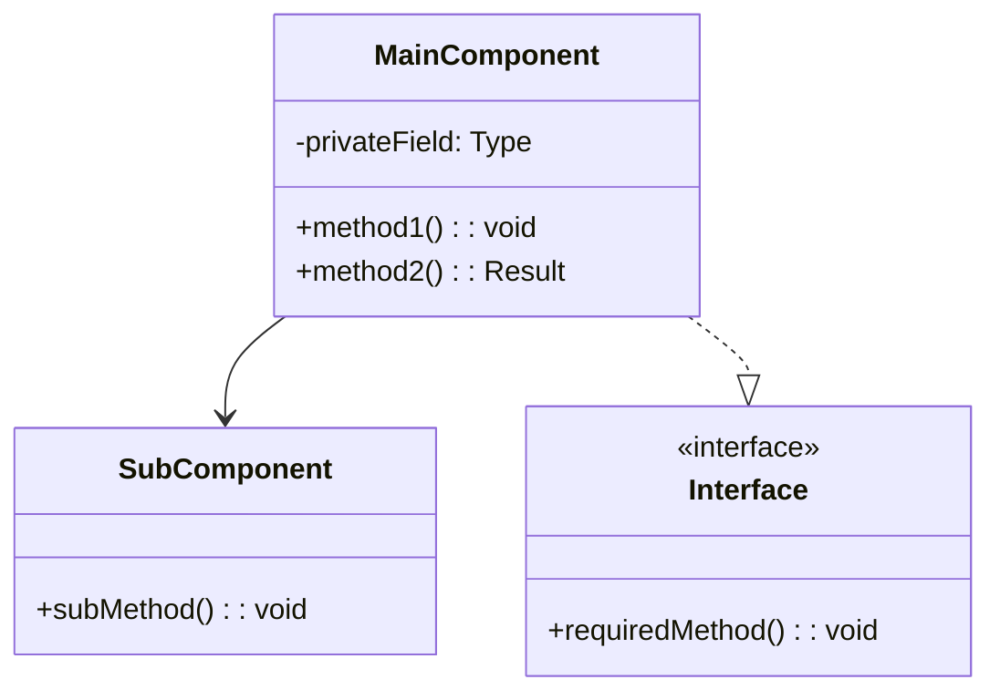
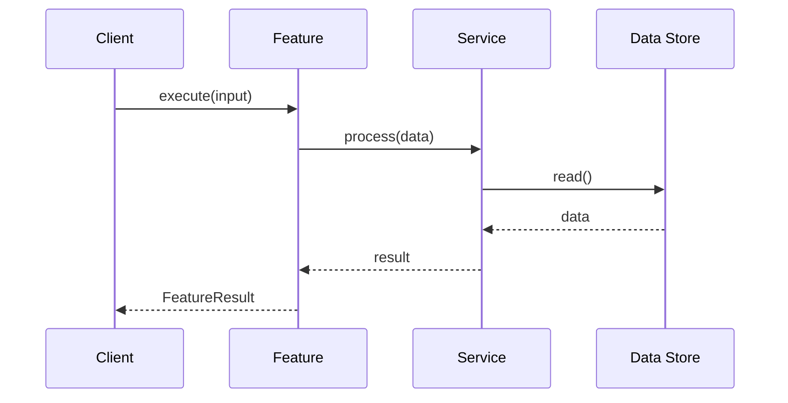
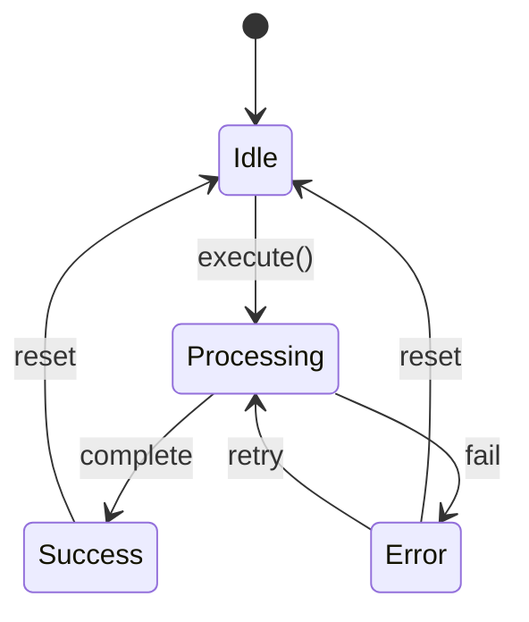

# Design: {{FEATURE_NAME}}

> **Phase**: 3/6 - Design  
> **Created**: {{DATE}}  
> **Status**: {{STATUS:🟡 Draft}}  
> **Agent**: `spec-architect`  
> **Based on**: [requirements.md](./requirements.md)

---

## 1. Architecture Overview

{{ARCHITECTURE_OVERVIEW}}

### 1.1 High-Level Architecture

```
┌─────────────────────────────────────────────────────────────┐
│                    SYSTEM ARCHITECTURE                       │
├─────────────────────────────────────────────────────────────┤
│                                                              │
│   ┌──────────┐    ┌──────────┐    ┌──────────┐              │
│   │  Layer 1 │───▶│  Layer 2 │───▶│  Layer 3 │              │
│   │          │    │          │    │          │              │
│   └──────────┘    └──────────┘    └──────────┘              │
│                                                              │
└─────────────────────────────────────────────────────────────┘
```

### 1.2 Design Principles

| Principle | Application |
|-----------|-------------|
| Single Responsibility | Each module has one clear purpose |
| Dependency Injection | Services injected via constructor |
| Interface Segregation | Small, focused interfaces |
| Open/Closed | Extension via plugins, not modification |

### 1.3 Technology Stack

| Layer | Technology | Justification |
|-------|------------|---------------|
| Runtime | Node.js 18+ | LTS support |
| Language | TypeScript 5.x | Type safety |
| Testing | Vitest | Fast, native ESM |

---

## 2. Component Design

{{COMPONENT_DESIGN}}

### 2.1 Module Structure

```
packages/
├── core/
│   └── src/
│       └── [feature]/
│           ├── index.ts           # Public exports
│           ├── types.ts           # Type definitions
│           ├── [feature].ts       # Main implementation
│           ├── [sub-module].ts    # Sub-components
│           └── __tests__/
│               └── [feature].test.ts
```

### 2.2 Component Diagram



### 2.3 Component Specifications

#### Component A: [Name]

| Property | Value |
|----------|-------|
| **Purpose** | <!-- description --> |
| **Location** | `packages/core/src/[path]` |
| **Dependencies** | Component B, Library X |
| **Public API** | `methodA()`, `methodB()` |

**Implementation Notes:**
- Note 1
- Note 2

#### Component B: [Name]

| Property | Value |
|----------|-------|
| **Purpose** | <!-- description --> |
| **Location** | `packages/core/src/[path]` |
| **Dependencies** | None |
| **Public API** | `methodC()` |

---

## 3. API Design

{{API_DESIGN}}

### 3.1 Public Interface

```typescript
// packages/core/src/[feature]/types.ts

/**
 * Configuration options for the feature
 */
export interface FeatureConfig {
  /** Enable/disable the feature */
  enabled: boolean;
  
  /** Custom setting */
  setting: string;
}

/**
 * Result returned by feature operations
 */
export interface FeatureResult {
  success: boolean;
  data?: unknown;
  error?: Error;
}

/**
 * Main feature interface
 */
export interface IFeature {
  /**
   * Initialize the feature
   */
  init(config: FeatureConfig): Promise<void>;
  
  /**
   * Execute the main operation
   */
  execute(input: Input): Promise<FeatureResult>;
  
  /**
   * Clean up resources
   */
  dispose(): Promise<void>;
}
```

### 3.2 Internal Interfaces

```typescript
// Internal implementation interfaces

interface InternalService {
  process(data: Data): ProcessedData;
}
```

### 3.3 Events

| Event Name | Payload Type | Description |
|------------|--------------|-------------|
| `feature:init` | `{ config }` | Emitted on initialization |
| `feature:complete` | `{ result }` | Emitted on completion |
| `feature:error` | `{ error }` | Emitted on error |

---

## 4. Data Flow

### 4.1 Sequence Diagrams

{{SEQUENCE_DIAGRAMS:N/A}}



### 4.2 State Transitions



### 4.3 Data Transformations

| Stage | Input | Output | Transformation |
|-------|-------|--------|----------------|
| 1 | Raw Input | Validated | Validation + sanitization |
| 2 | Validated | Processed | Business logic |
| 3 | Processed | Output | Formatting |

---

## 5. Error Handling

### 5.1 Error Types

```typescript
// packages/core/src/[feature]/errors.ts

export class FeatureError extends Error {
  constructor(
    message: string,
    public code: string,
    public cause?: Error
  ) {
    super(message);
    this.name = 'FeatureError';
  }
}

export class ValidationError extends FeatureError {
  constructor(message: string, public field: string) {
    super(message, 'VALIDATION_ERROR');
  }
}

export class ConfigurationError extends FeatureError {
  constructor(message: string) {
    super(message, 'CONFIG_ERROR');
  }
}
```

### 5.2 Error Recovery

| Error Type | Recovery Strategy |
|------------|-------------------|
| Validation | Return user-friendly message |
| Network | Retry with exponential backoff |
| Configuration | Fail fast with clear guidance |
| Unknown | Log, report, graceful degradation |

---

## 6. Security Considerations

### 6.1 Threat Model

| Threat | Risk | Mitigation |
|--------|------|------------|
| Input injection | Medium | Input validation |
| Data leakage | Low | Output sanitization |
| Unauthorized access | Medium | Permission checks |

### 6.2 Security Controls

- [ ] Input validation at all entry points
- [ ] Output encoding/escaping
- [ ] Least privilege principle
- [ ] Audit logging for sensitive operations

---

## 7. Testing Strategy

### 7.1 Unit Tests

| Component | Test Focus | Coverage Target |
|-----------|------------|-----------------|
| Component A | Core logic | 90% |
| Component B | Edge cases | 85% |
| Utilities | All functions | 100% |

### 7.2 Integration Tests

| Scenario | Components | Priority |
|----------|------------|----------|
| Happy path | A + B + C | High |
| Error handling | A + B | High |
| Edge cases | All | Medium |

### 7.3 Test Data

```typescript
// Test fixtures
export const testFixtures = {
  validInput: { /* ... */ },
  invalidInput: { /* ... */ },
  edgeCaseInput: { /* ... */ },
};
```

---

## 8. Architecture Decision Records

{{ADR_REFERENCES:None}}

### ADR-XXX: [Decision Title]

| Field | Value |
|-------|-------|
| **Status** | Proposed |
| **Context** | Why this decision is needed |
| **Decision** | What we decided |
| **Consequences** | Trade-offs and implications |

<!-- Link to full ADR: .vellum/adrs/ADR-XXX-title.md -->

---

## 9. Implementation Notes

### 9.1 Migration Path

<!-- If applicable, describe how to migrate from existing implementation -->

### 9.2 Feature Flags

| Flag | Purpose | Default |
|------|---------|---------|
| `feature_enabled` | Enable feature | `false` |
| `feature_beta` | Enable beta features | `false` |

### 9.3 Performance Optimizations

- Optimization 1: Description
- Optimization 2: Description

---

## Next Phase

**→ Phase 4: Tasks** (`spec-tasks` agent)

Pending user approval to proceed.
