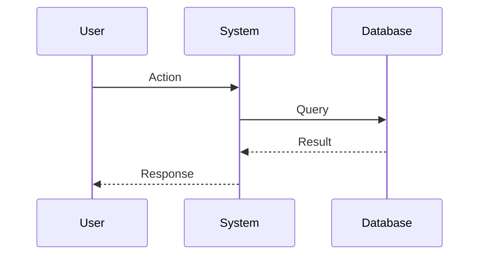

# Requirements: {{FEATURE_NAME}}

> **Phase**: 2/6 - Requirements  
> **Created**: {{DATE}}  
> **Status**: {{STATUS:🟡 Draft}}  
> **Agent**: `spec-requirements`  
> **Based on**: [research.md](./research.md)

---

## 1. Overview

### 1.1 Feature Summary

<!-- Brief description of the feature being specified -->

### 1.2 Scope

**In Scope:**
- Item 1
- Item 2

**Out of Scope:**
- Item 1
- Item 2

---

## 2. Functional Requirements

{{FUNCTIONAL_REQUIREMENTS}}

### 2.1 Core Features

| ID | Requirement | Priority | Source |
|----|-------------|----------|--------|
| FR-001 | <!-- requirement --> | Must/Should/Could | Research §X |
| FR-002 | <!-- requirement --> | Must/Should/Could | Research §X |

### 2.2 User Stories

#### US-001: [Title]

> **As a** [role],  
> **I want** [feature],  
> **So that** [benefit].

**Acceptance Criteria:**
- [ ] Given [context], when [action], then [outcome]
- [ ] Given [context], when [action], then [outcome]

#### US-002: [Title]

> **As a** [role],  
> **I want** [feature],  
> **So that** [benefit].

**Acceptance Criteria:**
- [ ] Given [context], when [action], then [outcome]

### 2.3 Use Cases



---

## 3. Non-Functional Requirements

{{NON_FUNCTIONAL_REQUIREMENTS}}

### 3.1 Performance

| ID | Requirement | Target | Measurement |
|----|-------------|--------|-------------|
| NFR-P01 | Response time | < 200ms | p95 latency |
| NFR-P02 | Throughput | > 100 req/s | Load test |

### 3.2 Security

| ID | Requirement | Implementation |
|----|-------------|----------------|
| NFR-S01 | Authentication | JWT tokens |
| NFR-S02 | Authorization | RBAC |
| NFR-S03 | Data protection | Encryption at rest |

### 3.3 Reliability

| ID | Requirement | Target |
|----|-------------|--------|
| NFR-R01 | Availability | 99.9% |
| NFR-R02 | Error rate | < 0.1% |
| NFR-R03 | Recovery time | < 30s |

### 3.4 Scalability

| ID | Requirement | Target |
|----|-------------|--------|
| NFR-SC01 | Concurrent users | 1000+ |
| NFR-SC02 | Data volume | 1M+ records |

### 3.5 Maintainability

| ID | Requirement | Approach |
|----|-------------|----------|
| NFR-M01 | Code coverage | > 80% |
| NFR-M02 | Documentation | JSDoc + README |
| NFR-M03 | Logging | Structured JSON |

---

## 4. Interface Requirements

### 4.1 API Contracts

```typescript
// Expected API signatures

interface FeatureAPI {
  // Method 1
  methodOne(param: Type): Promise<Result>;
  
  // Method 2
  methodTwo(param: Type): Promise<Result>;
}
```

### 4.2 Events/Hooks

| Event | Payload | When Emitted |
|-------|---------|--------------|
| `feature:created` | `{ id, data }` | After creation |
| `feature:updated` | `{ id, changes }` | After update |

### 4.3 Configuration

```typescript
interface FeatureConfig {
  enabled: boolean;
  setting1: string;
  setting2: number;
}
```

---

## 5. Data Requirements

### 5.1 Data Model

```typescript
interface DataModel {
  id: string;
  field1: string;
  field2: number;
  createdAt: Date;
  updatedAt: Date;
}
```

### 5.2 Validation Rules

| Field | Rule | Error Message |
|-------|------|---------------|
| `field1` | Required, max 255 chars | "Field1 is required" |
| `field2` | Min 0, max 100 | "Field2 must be 0-100" |

### 5.3 Migration

<!-- If applicable, describe data migration requirements -->

---

## 6. Constraints & Assumptions

### 6.1 Constraints

{{CONSTRAINTS:None}}

- Constraint 1
- Constraint 2

### 6.2 Assumptions

{{ASSUMPTIONS:None}}

- Assumption 1
- Assumption 2

---

## 7. Acceptance Criteria

{{ACCEPTANCE_CRITERIA}}

### 7.1 Feature Complete Checklist

- [ ] AC-001: Core functionality works
- [ ] AC-002: Edge cases handled
- [ ] AC-003: Error handling implemented
- [ ] AC-004: Tests passing
- [ ] AC-005: Documentation updated

### 7.2 Quality Gates

| Gate | Criteria | Status |
|------|----------|--------|
| Code Review | Approved by 2+ reviewers | ⬜ |
| Tests | All tests passing | ⬜ |
| Coverage | > 80% | ⬜ |
| Performance | Meets NFR targets | ⬜ |

---

## 8. Dependencies

### 8.1 Upstream Dependencies

| Dependency | Type | Status |
|------------|------|--------|
| Module A | Internal | Ready |
| Library B | External | Available |

### 8.2 Downstream Impact

| Component | Impact | Action Required |
|-----------|--------|-----------------|
| Component X | Minor | Update imports |
| Component Y | None | N/A |

---

## Next Phase

**→ Phase 3: Design** (`spec-architect` agent)

Pending user approval to proceed.
