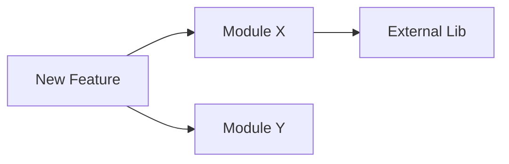

# Research: {{FEATURE_NAME}}

> **Phase**: 1/6 - Research  
> **Created**: {{DATE}}  
> **Status**: {{STATUS:🟡 Draft}}  
> **Agent**: `spec-researcher`

---

## 1. Problem Statement

{{PROBLEM_STATEMENT}}

### 1.1 User Request Summary

<!-- Paraphrased understanding of what user wants -->

### 1.2 Success Criteria

- [ ] Criterion 1
- [ ] Criterion 2
- [ ] Criterion 3

---

## 2. Codebase Analysis

### 2.1 Affected Modules

{{AFFECTED_MODULES}}

| Module | Path | Impact Level | Description |
|--------|------|--------------|-------------|
| <!-- module --> | <!-- path --> | High/Medium/Low | <!-- description --> |

### 2.2 Existing Patterns

<!-- Document relevant patterns found in the codebase -->

- **Pattern 1**: Description
- **Pattern 2**: Description

### 2.3 Dependencies

{{DEPENDENCIES}}

---

## 3. Technical Constraints

### 3.1 Performance Requirements

| Metric | Target | Current |
|--------|--------|---------|
| Response time | < 200ms | N/A |
| Memory | < 50MB | N/A |
| Throughput | TBD | N/A |

### 3.2 Compatibility

- **Runtime**: Node.js 18+
- **TypeScript**: 5.x
- **Dependencies**: <!-- list key deps -->

### 3.3 Security Considerations

- [ ] Authentication required
- [ ] Authorization checks needed
- [ ] Input validation required
- [ ] Rate limiting needed
- [ ] Data encryption required

---

## 4. External Research

{{EXTERNAL_RESEARCH:N/A}}

### 4.1 Similar Implementations

| Project/Library | Approach | Pros | Cons |
|-----------------|----------|------|------|
| <!-- name --> | <!-- approach --> | <!-- pros --> | <!-- cons --> |

### 4.2 Best Practices

- Practice 1: Description
- Practice 2: Description

### 4.3 References

- [Link 1](URL) - Description
- [Link 2](URL) - Description

---

## 5. Open Questions

{{OPEN_QUESTIONS:None}}

> ⚠️ These questions need user clarification before proceeding

1. Question 1?
2. Question 2?
3. Question 3?

---

## 6. Recommendations

### 6.1 Suggested Approach

<!-- High-level recommendation based on research -->

### 6.2 Risk Assessment

| Risk | Probability | Impact | Mitigation |
|------|-------------|--------|------------|
| <!-- risk --> | High/Medium/Low | High/Medium/Low | <!-- mitigation --> |

### 6.3 Estimated Effort

| Phase | Estimate |
|-------|----------|
| Requirements | X hours |
| Design | X hours |
| Implementation | X hours |
| Testing | X hours |

---

## Next Phase

**→ Phase 2: Requirements** (`spec-requirements` agent)

Pending user approval to proceed.
