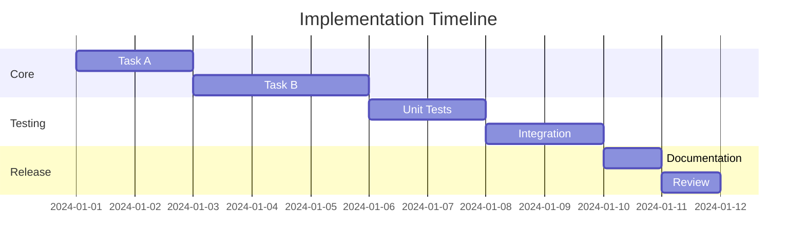
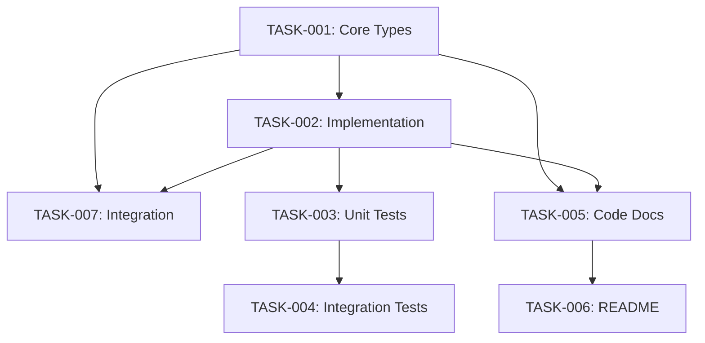

# Tasks: {{FEATURE_NAME}}

> **Phase**: 4/6 - Tasks  
> **Created**: {{DATE}}  
> **Status**: {{STATUS:🟡 Draft}}  
> **Agent**: `spec-tasks`  
> **Based on**: [design.md](./design.md)

---

## 1. Task Overview

### 1.1 Summary

| Metric | Value |
|--------|-------|
| Total Tasks | X |
| Estimated Effort | X hours |
| Critical Path | Tasks A → B → C |
| Blockers | None |

### 1.2 Task Categories

| Category | Count | Priority |
|----------|-------|----------|
| Core Implementation | X | High |
| Testing | X | High |
| Documentation | X | Medium |
| Integration | X | Medium |

---

## 2. Milestones

{{MILESTONES:N/A}}

| Milestone | Description | Target | Status |
|-----------|-------------|--------|--------|
| M1 | Core implementation complete | Day X | ⬜ |
| M2 | Tests passing | Day X | ⬜ |
| M3 | Documentation complete | Day X | ⬜ |
| M4 | Ready for review | Day X | ⬜ |

---

## 3. Task List

{{TASK_LIST}}

### 3.1 Core Implementation

#### TASK-001: [Task Title]

| Field | Value |
|-------|-------|
| **Priority** | 🔴 High |
| **Estimate** | 2 hours |
| **Assignee** | `vellum-coder` |
| **Depends On** | None |
| **Design Ref** | [Design §2.3](./design.md#23-component-specifications) |

**Description:**
<!-- Detailed description of what needs to be done -->

**Acceptance Criteria:**
- [ ] Criterion 1
- [ ] Criterion 2
- [ ] Criterion 3

**Files to Create/Modify:**
- `packages/core/src/[feature]/index.ts` - Create
- `packages/core/src/[feature]/types.ts` - Create

---

#### TASK-002: [Task Title]

| Field | Value |
|-------|-------|
| **Priority** | 🔴 High |
| **Estimate** | 3 hours |
| **Assignee** | `vellum-coder` |
| **Depends On** | TASK-001 |
| **Design Ref** | [Design §3](./design.md#3-api-design) |

**Description:**
<!-- Detailed description -->

**Acceptance Criteria:**
- [ ] Criterion 1
- [ ] Criterion 2

**Files to Create/Modify:**
- `packages/core/src/[feature]/[module].ts` - Create

---

### 3.2 Testing

#### TASK-003: Unit Tests

| Field | Value |
|-------|-------|
| **Priority** | 🔴 High |
| **Estimate** | 2 hours |
| **Assignee** | `vellum-coder` |
| **Depends On** | TASK-001, TASK-002 |
| **Design Ref** | [Design §7](./design.md#7-testing-strategy) |

**Description:**
Create unit tests for all new components.

**Acceptance Criteria:**
- [ ] All public methods tested
- [ ] Edge cases covered
- [ ] Coverage > 80%

**Test Cases:**
1. Test case 1: Description
2. Test case 2: Description
3. Test case 3: Description

**Files to Create:**
- `packages/core/src/[feature]/__tests__/[feature].test.ts`

---

#### TASK-004: Integration Tests

| Field | Value |
|-------|-------|
| **Priority** | 🟡 Medium |
| **Estimate** | 2 hours |
| **Assignee** | `vellum-coder` |
| **Depends On** | TASK-003 |
| **Design Ref** | [Design §7.2](./design.md#72-integration-tests) |

**Description:**
Create integration tests for component interactions.

**Acceptance Criteria:**
- [ ] Happy path tested
- [ ] Error scenarios tested
- [ ] All integrations verified

---

### 3.3 Documentation

#### TASK-005: Code Documentation

| Field | Value |
|-------|-------|
| **Priority** | 🟡 Medium |
| **Estimate** | 1 hour |
| **Assignee** | `vellum-coder` |
| **Depends On** | TASK-001, TASK-002 |
| **Design Ref** | N/A |

**Description:**
Add JSDoc comments to all public APIs.

**Acceptance Criteria:**
- [ ] All public methods documented
- [ ] Examples included
- [ ] Type documentation complete

---

#### TASK-006: README Update

| Field | Value |
|-------|-------|
| **Priority** | 🟢 Low |
| **Estimate** | 0.5 hours |
| **Assignee** | `vellum-coder` |
| **Depends On** | TASK-005 |
| **Design Ref** | N/A |

**Description:**
Update README with new feature documentation.

**Acceptance Criteria:**
- [ ] Feature description added
- [ ] Usage examples included
- [ ] Configuration documented

---

### 3.4 Integration

#### TASK-007: Wire Up to Main System

| Field | Value |
|-------|-------|
| **Priority** | 🔴 High |
| **Estimate** | 1 hour |
| **Assignee** | `vellum-coder` |
| **Depends On** | TASK-001, TASK-002 |
| **Design Ref** | [Design §4](./design.md#4-data-flow) |

**Description:**
Integrate new feature with existing system.

**Acceptance Criteria:**
- [ ] Exports added to package index
- [ ] Feature accessible via main API
- [ ] No breaking changes to existing code

---

## 4. Dependencies

{{DEPENDENCIES}}

### 4.1 Task Dependency Graph

### 4.2 External Dependencies

| Dependency | Required By | Status |
|------------|-------------|--------|
| Library X | TASK-002 | Available |
| Module Y | TASK-007 | Ready |

### 4.3 Blockers

| Task | Blocker | Resolution |
|------|---------|------------|
| None | N/A | N/A |

---

## 5. Estimates

{{ESTIMATES:N/A}}

### 5.1 Time Breakdown

| Category | Tasks | Estimate | Confidence |
|----------|-------|----------|------------|
| Core | TASK-001, 002 | 5 hours | High |
| Testing | TASK-003, 004 | 4 hours | Medium |
| Documentation | TASK-005, 006 | 1.5 hours | High |
| Integration | TASK-007 | 1 hour | High |
| **Total** | **7 tasks** | **11.5 hours** | Medium |

### 5.2 Risk Buffer

| Risk | Impact | Buffer |
|------|--------|--------|
| Unknown complexity | +2 hours | Included |
| Dependency delays | +1 hour | Included |
| **Adjusted Total** | | **14.5 hours** |

---

## 6. Execution Order

### 6.1 Recommended Sequence

1. **Phase A - Foundation**
   - TASK-001: Core Types (2h)

2. **Phase B - Implementation**
   - TASK-002: Implementation (3h)
   - TASK-007: Integration (1h) [parallel if possible]

3. **Phase C - Quality**
   - TASK-003: Unit Tests (2h)
   - TASK-005: Code Docs (1h) [parallel]

4. **Phase D - Completion**
   - TASK-004: Integration Tests (2h)
   - TASK-006: README Update (0.5h) [parallel]

### 6.2 Parallel Opportunities

| Tasks | Can Run Parallel | Savings |
|-------|-----------------|---------|
| TASK-002 + TASK-007 | Partial | ~0.5h |
| TASK-003 + TASK-005 | Yes | ~1h |
| TASK-004 + TASK-006 | Yes | ~0.5h |

---

## 7. Progress Tracking

### 7.1 Task Status Board

| Task ID | Title | Status | Progress |
|---------|-------|--------|----------|
| TASK-001 | Core Types | ⬜ Not Started | 0% |
| TASK-002 | Implementation | ⬜ Not Started | 0% |
| TASK-003 | Unit Tests | ⬜ Not Started | 0% |
| TASK-004 | Integration Tests | ⬜ Not Started | 0% |
| TASK-005 | Code Docs | ⬜ Not Started | 0% |
| TASK-006 | README Update | ⬜ Not Started | 0% |
| TASK-007 | Integration | ⬜ Not Started | 0% |

**Status Legend:**
- ⬜ Not Started
- 🔄 In Progress
- ✅ Completed
- ⏸️ Blocked
- ❌ Cancelled

---

## Next Phase

**→ Phase 5: Implementation** (`vellum-coder` agent)

Tasks will be executed in the order defined above. Each task completion will update the status board.

**→ Phase 6: Validation** (`spec-validator` agent)

After implementation completes, validation will verify all acceptance criteria are met.
